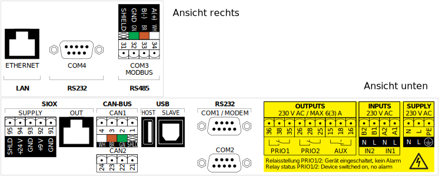

= Kolloquimsvortrag 
:revealjs_theme: solarized
:revealjs_controls: false
:revealjs_progress: true
:revealjs_slideNumber: true
:revealjs_transition: none

== Entwurf, prototypische Implementierung und Evaluation eines Sicherheitskonzepts für die Authentifizierung und Autorisierung von Fernzugriffen auf eine Automatisierungsanlage

Kolloquiumsvortrag Kevin Sapper +
20.10.14

== Grundlagen - Kälteanlage 

[.step]
.Übersicht Kälteanlage
image::../images/cairo/kaelteanlage_uebersicht.svg[img-kaelte]

[NOTE.speaker]
--
* Kälteanlage langsame Prozesse (Kühlen/Erwärmen)
* TCP/CAN
--

== Grundlagen - Marktrechner

[.step]
.Marktrechner

== Grundlagen - BSI Kataloge

* Bausteine
[.step]
** Gefährdungen
** Maßnahmen

== Grundlagen - Problem Structuring Methods

[.step]
* Soft Systems Methodology
* Data Flow Diagram

== Angreifertypen

[.step]
* Spionage
* Cyberkrieg
* Finanziell motiviert
* Selbstbestätigung des Egos
* Frustrierte oder verärgerte Mitarbeiter

== Hauptgefährdungen   

[.step]
** (D/L)DoS 
** MITM

== Distributionsproblem

[.step]
* Resultiert aus Vertrauensproblem
* "Keys fall from the sky" vs "Key Continuity Management" 

== Prototypische Implementierung (1)

.Design Prototypische Implementierung
image::../images/cairo/design_architekture.svg[img-architekture]

== Prototypische Implementierung (2)

[.step]
* Architekturbild
* Client-Zertifikate (Benutzer) -> Reverse Proxy (MITM, HTTPS)
* Shared Secret (M2M) für AVP -> wireshark, nee is nich, nur Passwort.
* LDAP-Rollen/Sevice-Name -> Policy check

== Demo

* Screenshots von FreeRADIUS-Server, Debug.
* Screenshots von LDAP, via Apache Directory Studio™
